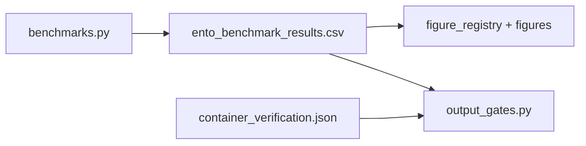

# ENTO architecture

Normative on-disk specification for the entofile reference implementation. **ENTO** stands for **EN**crypted, **T**yped, **O**mnitrack: a flat ZIP archive that seals each of an arbitrary number of typed tracks under authenticated encryption. Default format **0.4.0** uses AES-256-GCM with a 12-byte nonce, associated-data binding, and PADMÉ length padding; compatibility formats **0.2.0**, **0.3.0**, and **0.3.1** remain version-dispatched and readable/writable.

An ENTO file is plain ZIP, so any archive tool can list its members even without the key; only the per-track payloads are encrypted. A reader's path is always *verify, then unpack* — integrity is checked before any plaintext is released.

## ZIP layout

```
manifest.json
tracks/{track_id}.ento
proof/chain.json   # optional when observability >= 1
```

## Track binary (`*.ento`)

| Field | Size | Description |
| --- | --- | --- |
| nonce | 16 for `0.2.0`; 12 for `0.3.0`/`0.3.1`/`0.4.0` | GCM nonce |
| tag | 16 | GCM AEAD authentication tag |
| ciphertext | variable | Authenticated payload |

Kaitai: [`data/ento_track_header.ksy`](../data/ento_track_header.ksy).

## Cryptography

- Master key: 32 bytes (`genkey` CLI)
- Per-track key: `HKDF-SHA256(master, info="ento:track:{id}")`
- Pack and unpack: `cryptography` AES-256-GCM (`src/crypto_gcm.py`, facade `src/crypto.py`)

## Container verification

- `verify` / `unpack`: keyed AEAD integrity when a master key is supplied; keyless mode is digest/proof consistency only
- `inspect`: manifest schema + ZIP member set only

See [`security.md`](security.md) and manuscript `02c_security_verification.md`.

## Manifest

Validated by [`data/ento_manifest_schema.json`](../data/ento_manifest_schema.json).
`format_version` enum: `0.2.0`, `0.3.0`, `0.3.1`, `0.4.0`. The default writer
emits `0.4.0`; prior compatibility formats are explicit `pack --format` choices
and version-dispatched on read.

Track `type` URIs in `src/ontology.py`:

- `ento:timeseries.eeg`
- `ento:genomics.vcf`
- `ento:spectrogram`
- `ento:blockchain.proof`

## Observability levels

| Level | Name | Plaintext hashes | Resolution | Types |
| --- | --- | --- | --- | --- |
| 0 | sealed | hidden | hidden | opaque |
| 1 | typed | hidden | hidden | visible |
| 2 | resolved | hidden | visible | visible |
| 3 | auditable | visible | visible | visible |

Implementation: `filter_manifest()` in `src/observability.py`.

## Analysis pipeline



Entry: `scripts/ento_analysis.py` → `src/analysis.py::run_benchmark_pipeline`.
