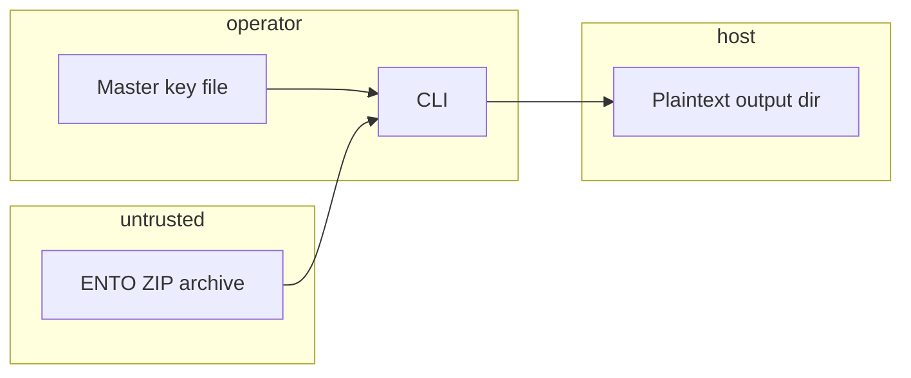

# entofile threat model

AppSec-oriented threat model for ENTO (`projects/working/entofile`). Packs default to `format_version` **0.4.0** (AES-256-GCM with AAD and PADMÉ padding); compatibility formats **0.2.0**, **0.3.0**, and **0.3.1** are version-dispatched and supported for write/read.

## Executive summary

ENTO is an offline CLI/library for encrypted research ZIP containers. Top risks are **hostile-archive ingestion** (ZIP/member tampering, path escape via track IDs), **integrity bypass**, and **operational key handling** (no in-repo HSM/signing). The default 0.4.0 write path and the prior compatibility paths use audited AEAD (`cryptography`); residual gaps include unsigned ZIP metadata, visible padded bucket sizes, optional proof at level 0, and no replay timestamps.

### Integrity model — what actually authenticates (read first)

**The master key (AES-256-GCM) is the only adversarial integrity anchor** [@nistfips197; @rfc5116; @dworkin2007gcm; @mcgrew2004gcm]. Decrypting a
track under the key authenticates that ciphertext; any tamper fails the GCM tag. The track key
is HKDF-derived with `info = "ento:track:<id>"`, so a ciphertext swapped to a different track
fails to decrypt — track context is bound implicitly through key derivation.

Everything ENTO can check **without** the key is *corruption detection only, not adversarial
authentication*:

- **Manifest `sha256_*` digests** are unkeyed and live in an unauthenticated manifest. An
  attacker who rewrites the container recomputes them (or blanks them — the schema permits
  empty digests for redacted exports).
- **The proof chain** is an unkeyed SHA-256 hash chain. It binds a proof to a given
  `manifest.json` and detects accidental edits, but carries **no secret**, so any party that
  controls the bytes can regenerate a self-consistent chain. It is a transparency/consistency
  structure, **not** a signature of origin.

`verify_container` reports this explicitly via its `integrity` field:
`"key-authenticated"` (key supplied, GCM passed), `"digest-only"` (keyless, digests present and
matched — corruption detection), or `"unverified"` (keyless, digests absent). Pass
`require_integrity=True` to fail closed on `"unverified"`. For adversarial assurance, always
verify (or unpack) **with the key**.

### Format ladder

Default writes use 0.4.0. Legacy formats remain selectable via `pack --format 0.2.0|0.3.0|0.3.1` / `pack_container(..., format_version=...)`; verify/unpack dispatch on the manifest's `format_version`.

**0.3.0** changes two things on the wire:

- **96-bit (12-byte) nonce** — the SP 800-38D-recommended GCM nonce length (replaces 0.2.0's 16-byte nonce). Still a fresh CSPRNG draw per encryption.
- **AEAD associated data** = `ento:0.3.0:track:<track_id>` — binds the **format version** and **track id** to the authentication tag. A format downgrade (rewriting the manifest to `0.2.0`) or a cross-track relabel now fails the GCM tag, closing the unauthenticated-header gap for fields with a stable, reconstructible value. Manifest fields with no decrypt-time analogue (creator, timestamps) remain unauthenticated — sign externally if origin authentication is required.

**0.3.1** = 0.3.0 **+ PADMÉ length-padding** (AAD = `ento:0.3.1:track:<track_id>`). Each track's plaintext is length-prefixed and padded up to a PADMÉ bucket [@nikitin2019purb] before encryption, so the on-disk ciphertext size reveals only the bucket, not the exact plaintext length — closing the length side-channel (below). PADMÉ overhead is O(log log L) (≈6% at 4 KiB). The padding scheme is bound by the version in the AAD, so a padded↔unpadded downgrade fails authentication. Use 0.3.1 when length analysis is in scope (e.g. SEALED exports of low-entropy/enumerated payloads).

**0.4.0** promotes the 0.3.1 security profile to the default writer (AAD =
`ento:0.4.0:track:<track_id>`). It mitigates exact-length disclosure by default,
but still exposes ZIP names, member presence, and PADMÉ bucket size.
AES-GCM-SIV is a future-format candidate when deployments cannot bound nonce
uniqueness assumptions, but ENTO does not implement it in 0.4.0 [@rfc8452].

### Nonce and AAD (legacy compatibility format 0.2.0)

- **16-byte nonce, randomly generated.** Each nonce is `secrets.token_bytes(16)` — a fresh CSPRNG
  draw per encryption, never a counter (so there is no counter-reuse hazard). Standard AES-GCM uses
  a 96-bit (12-byte) nonce; the 16-byte nonce exercises GCM's GHASH-based J0 derivation, a
  deliberate deviation from SP 800-38D §8.2. Because nonces are random and 128-bit, the
  birthday-bound collision margin is *larger* than the 96-bit case: stay below ~2⁴⁸ messages **per
  track key** for a <2⁻³² collision probability (the per-track HKDF derivation means this budget is
  per track, not global). It is **frozen** for legacy 0.2.0 compatibility; 0.3.0 introduced the
  96-bit nonce/AAD profile and 0.4.0 is the current default. A repeated GCM nonce under the same key is still a catastrophic
  misuse condition, not a recoverable validation warning [@joux2006forbidden; @bock2016nonce].
- **What "key-authenticated" covers.** GCM with no AAD authenticates the **track plaintext** only.
  The track_id is bound via the HKDF `info` label, so cross-track swaps fail. Unkeyed manifest
  header fields (`format_version`, `observability_level`, `creator`) are **not** authenticated at
  any level; a keyed verify still cannot be downgraded by mutating them, because the integrity
  level is derived from the decrypt attempt, not read from the header.
- **No AAD.** Tracks are encrypted with `associated_data=None`. Track context is bound via the
  HKDF `info` label (above) rather than GCM AAD, so a cross-track ciphertext swap is already
  rejected by key derivation. Binding `format_version`/manifest fields as explicit AAD is a
  defense-in-depth improvement introduced in 0.3.0 and promoted into the 0.4.0 default path (it changes
  the authenticated input and would not decrypt existing 0.2.0 containers).

## Scope and assumptions

**In scope:** `src/` (crypto, container, CLI, manifest, proof, security), `scripts/ento_cli.py`, `data/ento_manifest_schema.json`, benchmark/analysis pipeline writing local files.

**Out of scope:** Layer 1 template CI, Ollama/LLM stages, network services, Zenodo deposit automation.

**Assumptions (validate for your deployment):**

- Operators run CLI locally on researcher workstations or batch nodes.
- Untrusted `.ento.zip` files may arrive from collaborators or public mirrors.
- Master keys are out-of-band secrets; ENTO does not provide escrow,
  cryptoperiod policy, or HSM/KMS custody [@nistsp80057pt1r5].
- Internet exposure: none (no listening ports).

**Open questions:** multi-tenant hosting, centralized key vault, mandatory artifact signing policy.

## System model

### Primary components

| Component | Role | Evidence |
| --- | --- | --- |
| CLI | genkey, pack, unpack, verify, inspect, proof | `src/cli.py` |
| Container | ZIP pack/unpack/verify | `src/container.py` |
| Crypto | HKDF, AES-256-GCM AEAD | `src/crypto.py`, `src/crypto_gcm.py` |
| Verification report | Per-container verify JSON | `src/verification_report.py` |
| Manifest | JSON Schema validation | `src/manifest.py`, `data/ento_manifest_schema.json` |
| Security | Track ID policy, ZIP limits, safe paths | `src/security.py` |
| Analysis | Benchmarks → figures (local I/O) | `src/analysis.py` |

### Data flows and trust boundaries

- **Operator → CLI:** key file, fixture dir, container path, output dir — local filesystem, no auth layer.
- **Publisher → recipient:** ENTO ZIP (manifest + encrypted tracks [+ proof]) — confidentiality from AES-256-GCM; adversarial integrity from GCM AEAD on key-based verify (the unkeyed digests/proof are corruption checks only).
- **Untrusted ZIP → verify/unpack:** attacker-controlled archive bytes — must fail closed (`verify_container`, `unpack_container`).

#### Diagram

## Assets and security objectives

| Asset | Why it matters | Objective |
| --- | --- | --- |
| Master key | Decrypts all tracks | C |
| Plaintext tracks | Research data | C, I |
| Manifest metadata | Types, digests, observability | C, I |
| Proof chain | Manifest binding | I |
| Host filesystem | CLI output paths | I, A |

## Attacker model

### Capabilities

- Supply malicious or tampered ENTO ZIP files.
- Read sealed manifests without key (metadata/filename leakage).
- Local access to run CLI with operator privileges.

### Non-capabilities

- Remote exploitation without operator executing CLI on the archive (no network daemon).
- Break AES-256-GCM or HKDF-SHA256 without key or implementation flaw (assumed out of scope for this reference).

## Entry points and attack surfaces

| Surface | How reached | Trust boundary | Notes | Evidence |
| --- | --- | --- | --- | --- |
| CLI argv/paths | Shell | Operator ↔ host FS | Paths user-supplied | `src/cli.py` |
| ZIP read | `-i container` | Untrusted → parser | zipfile + limits | `src/security.py` |
| manifest.json | Inside ZIP | Untrusted → jsonschema | Schema + track id pattern | `data/ento_manifest_schema.json` |
| Track blobs | `tracks/*.ento` | Untrusted → crypto | GCM AEAD authenticates at decrypt | `src/crypto.py`, `src/crypto_gcm.py` |
| Key file | `-k` | Operator secret | 32-byte check | `src/cli.py:_load_key` |

## Top abuse paths

1. **Path escape on unpack** — Malicious manifest track id `../../etc/passwd` → write outside output dir (CWE-22) → **Mitigated:** `validate_track_id`, `safe_output_path` (`src/security.py`, `src/cli.py`) [@cwe22].
2. **Ciphertext swap** — Replace track blob, keep manifest → decrypt wrong data → **Mitigated (key-based):** GCM authentication fails on `unpack_container` / keyed `verify_container`. The keyless `sha256_ciphertext` check only detects accidental corruption — an attacker recomputes or blanks the digest (`src/container.py`).
3. **Manifest swap** — Alter manifest.json → **Partially mitigated:** `verify_proof_export` detects a manifest that no longer matches its proof, but the proof is **unkeyed** and the attacker regenerates it. Adversarial detection of a manifest swap still relies on key-based decryption mismatching the rewritten descriptors (`src/proof.py`, `src/container.py`).
4. **ZIP bomb** — Oversized members → DoS / data amplification (CWE-409) → **Mitigated:** size limits (`src/security.py`) [@cwe409].
5. **Extra member injection** — Hidden tracks/malware file in ZIP → **Mitigated:** member-set equality check (`assert_zip_members_match_manifest`).
6. **Key exfil via world-readable genkey** — Local user reads key → **Partially mitigated:** `chmod 0600` on genkey; operator discipline required.
7. **Sealed export metadata leak** — Level 0 still exposes track filenames in ZIP → Residual risk documented in manuscript §08.
8. **Sealed plaintext-length disclosure** — at format 0.2.0/0.3.0, SEALED zeroes the manifest `byte_length`, but AES-GCM is length-preserving and containers are ZIP_STORED, so each track's plaintext length is still recoverable from its on-disk member size (`member_size − nonce − 16`). Formats 0.3.1 and default 0.4.0 PADMÉ-pad the plaintext so the member size reveals only a bucket. Bucket size remains visible and should be treated as residual metadata.

## Threat model table

| ID | Threat | Impact | Controls (evidence) | Gaps | Mitigations | Priority |
| --- | --- | --- | --- | --- | --- | --- |
| TM-001 | Path escape via track id [@cwe22] | Host file write | `validate_track_id`, `safe_output_path` | None in v0.1.1+ | Keep schema pattern aligned | medium |
| TM-002 | Ciphertext tamper | Wrong/malicious plaintext | GCM AEAD on key-based unpack/verify; keyless digest = corruption-detection only | Keyless verify is NOT adversarial; digests are blankable/recomputable | Verify/unpack **with the key**; `require_integrity=True` to reject unverified | high |
| TM-003 | Manifest/proof mismatch | Undetected swap | `verify_proof_export` (consistency only); key-based descriptor mismatch | Proof chain is **unkeyed** → attacker regenerates it; proof omitted at level 0 | Key-based verify; external signing for origin authentication | high |
| TM-004 | ZIP bomb / DoS [@cwe409] | Availability | Size/member limits | Defaults may be high for some envs | Tune limits | medium |
| TM-005 | Weak crypto implementation | Confidentiality break | GCM regression vectors + tamper benchmarks | Not FIPS-validated deployment | HSM + FIPS module selection | medium |
| TM-006 | No artifact signing | Supply-chain swap | Optional CycloneDX SBOM via `scripts/export_sbom.py` | No in-repo Sigstore/provenance policy | Sign releases and SBOMs externally using NIST C-SCRM / SLSA / in-toto style controls [@nist2022sp800161r1; @slsa2024levels; @torresarias2019intoto] | medium |
| TM-007 | Key mishandling | Key theft | genkey CSPRNG, chmod 600 | No HSM/KMS or cryptoperiod policy | KMS/HSM integration and key-management policy outside the file format [@nistsp80057pt1r5] | high |
| TM-008 | Sealed plaintext-length disclosure | Metadata inference | Default `0.4.0` and compatibility `0.3.1` PADMÉ padding; explicit residual docs for `0.2.0`/`0.3.0` | Bucket size remains visible; exact length leaks in unpadded formats | Use default `0.4.0` for length-sensitive sealed exports | medium |

## Criticality calibration

- **Critical:** Pre-auth RCE — N/A (CLI only).
- **High:** Integrity bypass on unpack, key theft from world-readable files, custom crypto break.
- **Medium:** ZIP DoS, metadata leakage at sealed export, missing proof on audit paths.
- **Low:** Informational manifest fields at level 3 without key.

## Focus paths for security review

| Path | Why | Threat IDs |
| --- | --- | --- |
| `src/container.py` | Verify/unpack orchestration | TM-002, TM-003 |
| `src/security.py` | ID policy, ZIP limits | TM-001, TM-004 |
| `src/crypto.py` | Custom crypto surface | TM-005 |
| `src/padding.py` | Length-hiding padding | TM-008 |
| `src/cli.py` | Operator entrypoints | TM-001, TM-007 |
| `src/proof.py` | Manifest binding | TM-003 |
| `data/ento_manifest_schema.json` | Input validation contract | TM-001 |

## MITRE ATT&CK mapping (lightweight)

| Technique | Name | ENTO control | Evidence |
| --- | --- | --- | --- |
| T1565.001 | Stored data manipulation | GCM AEAD on key-based verify/unpack (digests are corruption-detection only) | `verify_container(key=...)`, `decrypt_track` |
| T1499 | Endpoint denial of service | ZIP size/member limits | `validate_zip_archive` |
| T1083 | File and directory discovery | Sealed observability redaction | `filter_manifest` level 0 |
| T1005 | Data from local system | Safe unpack paths | `validate_track_id`, `safe_output_path` |
| T1552.001 | Credentials in files | `genkey` chmod 0600 | `src/cli.py` genkey |
| T1190 | Exploit public-facing app | N/A | No network service |

Mapping is illustrative for offline CLI scope—not a FedRAMP control baseline.

## Quality check

- Entry points: CLI, ZIP, manifest, key file — covered.
- Trust boundaries: operator/untrusted/host — in diagram and flows.
- Runtime vs CI: analysis pipeline local-only; CI runs tests without production keys.
- Assumptions: documented above; confirm deployment model with service owner.
