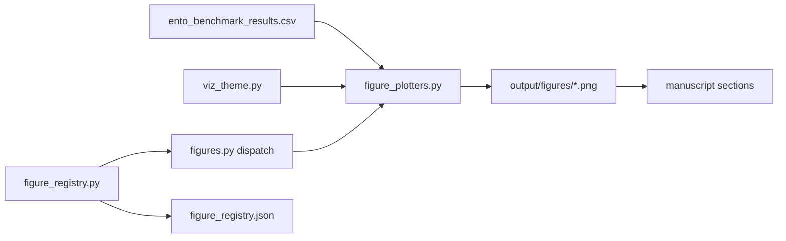

# Figure registry — entofile

Manuscript figures are **code-derived**: generators read benchmark CSV rows and write PNGs under `output/figures/`.

## Pipeline



1. `scripts/ento_analysis.py` → `src/analysis.py::run_benchmark_pipeline`
2. `configure_viz(load_experiment_config().viz)` sets DPI/figsize via `viz_theme.bind_viz`
3. `generate_all_figures(csv, figures_dir)` dispatches `getattr(figures, spec.generator_name)` for each `FigureSpec`
4. `write_figure_registry` records `generated_by`, caption, `caption_token`, `kind`, `manuscript_section`, CSV path, visual takeaway, evidence class, and caution
5. `scripts/z_generate_manuscript_variables.py` substitutes `{{TOKEN}}`s (including `{{FIG_CAPTION_*}}`, `{{FIGURE_INDEX}}`, optional `{{FIGURE_BLOCK_*}}`)
6. PDF render reads `../output/figures/*.png` from substituted markdown

## Registered figures (21)

| Label | File | Kind | Section | Generator |
| --- | --- | --- | --- | --- |
| `fig:benchmark_overview` | `benchmark_overview.png` | panel | results | `generate_benchmark_overview_figure` |
| `fig:throughput_benchmark` | `throughput_benchmark.png` | scatter | results | `generate_throughput_figure` |
| `fig:expansion_ratio` | `expansion_ratio.png` | bar | results | `generate_expansion_figure` |
| `fig:expansion_heatmap` | `expansion_heatmap.png` | heatmap | results | `generate_expansion_heatmap_figure` |
| `fig:observability_manifest_size` | `observability_manifest_size.png` | line | results | `generate_observability_figure` |
| `fig:unpack_latency` | `unpack_latency.png` | bar | benchmark_interp | `generate_unpack_latency_figure` |
| `fig:throughput_by_observability` | `throughput_by_observability.png` | line | benchmark_interp | `generate_throughput_by_observability_figure` |
| `fig:observability_throughput_tradeoff` | `observability_tradeoff.png` | scatter | benchmark_interp | `generate_observability_tradeoff_figure` |
| `fig:manifest_multitrack` | `manifest_multitrack.png` | line | methodology | `generate_manifest_multitrack_figure` |
| `fig:crypto_overhead` | `crypto_overhead.png` | bar | methodology | `generate_crypto_overhead_figure` |
| `fig:expansion_law` | `expansion_law.png` | line | benchmark_interp | `generate_expansion_law_figure` |
| `fig:throughput_dispersion` | `throughput_dispersion.png` | scatter | benchmark_interp | `generate_throughput_dispersion_figure` |
| `fig:determinism_cv` | `determinism_cv.png` | bar | benchmark_interp | `generate_determinism_cv_figure` |
| `fig:format_ladder` | `format_ladder.png` | ladder | security | `generate_format_ladder_figure` |
| `fig:format_compatibility_matrix` | `format_compatibility_matrix.png` | heatmap | security | `generate_format_compatibility_matrix_figure` |
| `fig:length_leakage_profile` | `length_leakage_profile.png` | line | security | `generate_length_leakage_profile_figure` |
| `fig:conformance_outcomes` | `conformance_outcomes.png` | heatmap | security | `generate_conformance_outcomes_figure` |
| `fig:observability_redaction_matrix` | `observability_redaction_matrix.png` | heatmap | methodology | `generate_observability_redaction_matrix_figure` |
| `fig:release_evidence_map` | `release_evidence_map.png` | bar | reproducibility | `generate_release_evidence_map_figure` |
| `fig:security_control_matrix` | `security_control_matrix.png` | heatmap | security | `generate_security_control_matrix_figure` |
| `fig:tamper_detection` | `tamper_detection.png` | bar | security | `generate_tamper_figure` |

Source of truth: `src/figure_registry.py::FIGURE_SPECS`. Manuscript metrics use the same filters via `src/benchmark_stats.py::avg_field` and `filter_rows_for_spec`.
The RedTeam visualization confirmation for the rendered PDF is
[`redteam_repo_visual_audit_0.4.md`](redteam_repo_visual_audit_0.4.md).

## Visual evidence contract

Each figure carries three reader-facing fields in `output/figures/figure_registry.json`:
`takeaway` (what the figure is meant to show), `evidence` (which generated data
or code-owned contract backs it), and `caution` (what the reader must not infer).
These fields are generated from `src/figure_registry.py` and validated by
`tests/test_figures.py`, `tests/test_figure_registry_helpers.py`, and
`src/output_gates.py`.

| Figure | Takeaway | Evidence | Caution |
| --- | --- | --- | --- |
| `fig:benchmark_overview` | Orients readers to the four headline benchmark surfaces. | Composite of registered throughput, expansion, observability, and tamper views. | Summary panel only; use standalone figures for exact filters and labels. |
| `fig:throughput_benchmark` | Shows local pack-throughput dispersion for the medium synthetic track. | Wall-clock `pack_throughput_mib_s` rows filtered to auditable medium tracks. | Host-state timing snapshot; not a cross-host performance superiority claim. |
| `fig:expansion_ratio` | Shows per-fixture ciphertext expansion under the default profile. | Data-derived plaintext and ciphertext byte counts from fixture tracks. | Small-track overhead is expected; do not generalize the ratio to all payload sizes. |
| `fig:expansion_heatmap` | Separates fixed-header overhead from payload size across benchmark conditions. | Mean expansion ratios by base condition and track id. | Color intensity encodes ratios, not security strength. |
| `fig:observability_manifest_size` | Shows the manifest-size cost of each observability level for the EEG fixture. | Manifest byte counts across exported levels for `track_id=eeg`. | Manifest redaction does not hide ZIP names, member presence, or bucketed size. |
| `fig:unpack_latency` | Compares local pack and verify-before-unpack wall-clock costs. | Mean `pack_seconds` and `unpack_seconds` for auditable medium-track rows. | Timing includes local host conditions and should be interpreted with dispersion figures. |
| `fig:throughput_by_observability` | Checks whether manifest redaction changes medium-track pack throughput locally. | Per-level throughput means with min-max repetition bands. | Flatness is local-run evidence, not a portable performance law. |
| `fig:observability_throughput_tradeoff` | Visualizes manifest-size versus throughput coupling in the generated matrix. | Medium-track manifest bytes and pack throughput rows. | Scatter shape is exploratory and does not establish causality. |
| `fig:manifest_multitrack` | Compares observability redaction behavior across heterogeneous fixture tracks. | Manifest byte counts by level for eeg, vcf, and spectrogram fixtures. | Only manifest size is plotted; encrypted payload bytes are unchanged by export level. |
| `fig:crypto_overhead` | Decomposes each track member into fixed AEAD header and encrypted body bytes. | Ciphertext byte counts and the code-defined nonce/tag header size. | The body includes padding; the stack is byte composition, not runtime cost. |
| `fig:expansion_law` | Binds measured expansion ratios to the version-aware closed-form model. | Fixture byte counts, format version, and `expansion_ratio_model` residuals. | The law covers stored member bytes, not compression or transport overhead. |
| `fig:throughput_dispersion` | Shows timing variability instead of hiding it behind one mean. | Per-repetition medium-track throughput plus Student-t interval summary. | The confidence interval describes this release run under local conditions. |
| `fig:determinism_cv` | Explains why deterministic columns are fingerprinted and timing columns are not. | Coefficient of variation by benchmark metric and fingerprint column class. | Zero CV is a generated-matrix property, not proof that every future metric is deterministic. |
| `fig:format_ladder` | Summarizes the supported wire-format ladder and default writer choice. | Code-owned supported-format constants and hardening features. | Compatibility support does not mean older formats are the current default. |
| `fig:format_compatibility_matrix` | Makes read/write/default and hardening features explicit per format. | Supported format dispatch, nonce policy, AAD policy, and padding policy. | A yes/no cell is capability metadata, not an interoperability certification. |
| `fig:length_leakage_profile` | Contrasts exact legacy length leakage with default PADME bucket disclosure. | Version-aware member-size model over small plaintext lengths. | PADME hides exact length only to buckets; ZIP metadata remains visible. |
| `fig:conformance_outcomes` | Shows known-good and known-bad fixture expectations for all supported formats. | Deterministic conformance cases generated and verified by `src/conformance.py`. | Fixture coverage is a release gate, not independent implementation diversity. |
| `fig:observability_redaction_matrix` | Shows which manifest fields survive each export level. | Code-documented observability policy for manifest field classes. | This matrix describes manifest exports, not cryptographic decryption policy. |
| `fig:release_evidence_map` | Maps the release candidate to its generated evidence surfaces. | Benchmark, figure, conformance, SBOM, checksum, PDF, and HTML artifacts. | Evidence completeness is local until public endpoints and signatures exist. |
| `fig:security_control_matrix` | Separates repository-enforced controls from deployment-residual controls. | Threat IDs, code/tests/docs coverage, and external-control annotations. | External cells require operator infrastructure outside `.ento.zip`. |
| `fig:tamper_detection` | Reports generated tag-byte tamper rejection across the benchmark matrix. | Tamper rows produced by benchmark corruptions and key-based unpack outcomes. | This covers generated tag-byte corruption, not every possible misuse scenario. |

## Adding a figure

1. Add plot function to `src/figure_plotters.py` and dispatch in `src/figures.py`
2. Append `FigureSpec` to `FIGURE_SPECS` (include `kind`, `manuscript_section`, `figsize_key`)
3. Add `{#fig:label}` and `[@fig:label]` prose to the target manuscript file
4. Extend `tests/test_figures.py`, `tests/test_figure_captions.py`, `tests/test_figure_crossrefs.py`
5. Update `manuscript/SYNTAX.md` figure table (or rely on registry tests)
6. Add or update visual `takeaway`, `evidence`, and `caution` in `src/figure_registry.py`

Helpers: `manuscript_image_markdown(spec)`, `figure_block_markdown(section)`, `figure_index_markdown()`.

## Configuration

```yaml
experiment:
  viz:
    dpi: 300
    figsize: [8, 5]
    figure_width_percent: 90
    font_size: 10
    grid_alpha: 0.3
```

Claim ledger entry `figure-export-dpi` must match `experiment.viz.dpi`. `figure-display-width` must match `figure_width_percent` (verified by `tests/test_claim_ledger.py`).
