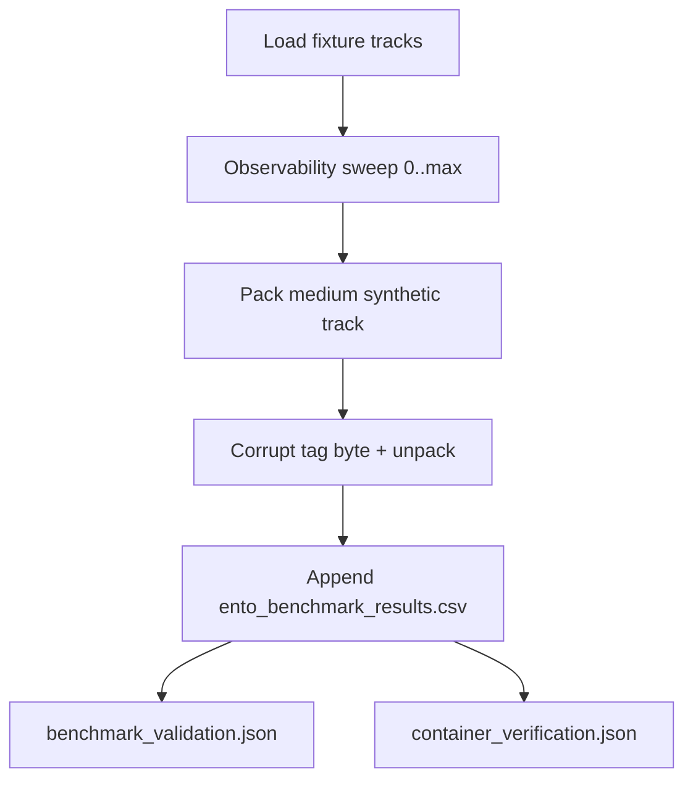
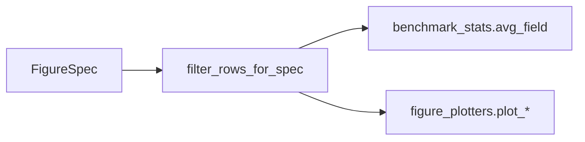
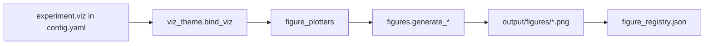

# Methods reference — entofile

Normative algorithms and configurable parameters for ENTO default format **0.4.0** (AES-256-GCM with associated-data binding and PADMÉ length padding) plus compatibility formats **0.2.0**, **0.3.0**, and **0.3.1**. Implementation lives under [`../src/`](../src/); figures are code-derived from [`output/data/ento_benchmark_results.csv`](../output/data/ento_benchmark_results.csv).

## First-principles boundary

ENTO is built around a small set of hard constraints rather than format-fashion
assumptions:

| Constraint | Consequence for methods |
| --- | --- |
| ZIP member names and sizes are visible before decryption | Observability redacts manifest fields, not ZIP metadata; default `0.4.0` hides exact length only to PADMÉ buckets. |
| AEAD authenticates only with the key and associated data actually supplied | Keyed `verify`/`unpack` is the adversarial integrity path; keyless digest checks are corruption detection only. |
| Wall-clock timing is host-state dependent | Timing metrics are re-measured and reported with dispersion; deterministic benchmark columns get the reproducibility fingerprint. |
| Paper and wire versions differ in shape | Paper release `0.4` documents default wire format `0.4.0`; prior wire formats remain explicit compatibility choices. |
| No-mock evidence is not the same as all-real-world input data | Benchmarks and conformance use documented fixture, synthetic stress, and test-vector inputs; generated reports and rendered artifacts are real executions. |

## Cryptography (`src/crypto.py`)

| Operation | Function | Notes |
| --- | --- | --- |
| Master key | `generate_master_key()` | 32 random bytes |
| Per-track key | `derive_track_key(master, track_id)` | HKDF-SHA256 [@krawczyk2010hkdf], `info = "ento:track:{track_id}"` |
| Encrypt / decrypt | `encrypt_payload` / `decrypt_payload` | default `0.4.0`; compatibility `0.2.0`/`0.3.0`/`0.3.1` dispatch through `src/crypto_gcm.py` |
| Suite name | `crypto_backend_for_format(version)` | Maps supported formats to `aes-256-gcm` |

Wire layout per track: `nonce || tag(16) || ciphertext`. Default `0.4.0` uses a
12-byte nonce, binds `format_version` plus `track_id` as AEAD associated data, and
encrypts a PADMÉ-padded body. Legacy `0.2.0` uses a 16-byte nonce and no AAD;
`0.3.0`/`0.3.1` use the 12-byte/AAD path, with padding added in `0.3.1`.

Known-answer tests: `data/test_vectors/hkdf_regression.json`, `aes256_gcm_regression.json`.

## Benchmark protocol (`src/benchmarks.py`)

Entry: `scripts/ento_analysis.py` → `src/analysis.py::run_benchmark_pipeline`.

For each repetition and observability level:

1. Pack committed fixture tracks (`small_tracks_r*`) at that export level.
2. Pack a synthetic medium track (`CONFIG_MEDIUM_TRACK_BYTES`) for throughput rows.
3. Flip one ciphertext tag byte and record whether unpack fails closed (`tamper_detected`).
4. Record pack/unpack seconds, expansion ratio, manifest bytes, and digests.

CSV columns match `BenchmarkRow.to_csv_row()` in `src/benchmarks.py`. Validation requires `tamper_detection_rate == 1.0` and `status: pass` in `output/reports/benchmark_validation.json`.
The evidence boundary is documented in [`evidence_provenance.md`](evidence_provenance.md):
fixture tracks are deterministic committed inputs, the medium track is a
synthetic stress input, conformance containers are deterministic test vectors,
and the CSV/reports/figures/PDF are real generated outputs.
The release configuration owns the benchmark repetition count and the manuscript injects the derived row counts from generated variables. Routine tests use an internal config override on temporary project roots so they exercise the same pipeline without rewriting release outputs.

Filter constants for figures and manuscript stats: `AUDITABLE_LEVEL`, `MEDIUM_TRACK_PREFIX`, `SMALL_TRACKS_R0_PREFIX` in [`src/benchmark_filters.py`](../src/benchmark_filters.py).

### Determinism contract

The benchmark CSV carries two kinds of columns, and they must never be averaged or
hashed across the boundary:

| Class | Columns | Reproducibility |
| --- | --- | --- |
| **Deterministic** (`DETERMINISTIC_BENCHMARK_COLUMNS`) | `format_version`, `condition`, `track_id`, `track_type`, `plaintext_bytes`, `ciphertext_bytes`, `expansion_ratio`, `tamper_detected`, `observability_level`, `manifest_bytes` | **Byte-exact across runs.** Expansion follows the version-aware identity `r(n) = (H + PADME(n + 8)) / n` for default `0.4.0` and `r(n) = (H + n) / n` for unpadded compatibility formats; manifest sizes are fixed by the export schema; tamper outcomes are deterministic. |
| **Volatile** (`VOLATILE_BENCHMARK_COLUMNS`) | `pack_seconds`, `unpack_seconds`, `pack_throughput_mib_s` | **Re-measured every run** (host-load dependent). Reported with dispersion (sd, CV, 95% t-CI), never as a reproducibility target. |

`benchmark_data_fingerprint(rows)` in [`src/benchmark_stats.py`](../src/benchmark_stats.py)
is the SHA-256 of *only* the deterministic columns, projected in fixed order and sorted so
the value is independent of CSV row order. It is exposed as the manuscript variable
`BENCHMARK_DATA_FINGERPRINT` and is the honest reproducibility anchor: regenerating the
pipeline on any host reproduces it exactly, whereas the whole-CSV SHA-256
(`BENCHMARK_CSV_SHA256`) changes every run and is only a one-run provenance stamp.
`tests/test_data_fingerprint.py` pins reproducibility and includes a per-column negative
control proving a silent relabel of any deterministic cell changes the fingerprint.

## Figure filter contract

Manuscript metrics and plots share one filter path:

- Registry: [`src/figure_registry.py`](../src/figure_registry.py) — `FIGURE_SPECS`, `spec_filter_description()`, `plot_title()`
- Captions: `figure_caption()` embeds the same filter phrase as plot titles
- Manuscript: `generate_variables()` in [`src/manuscript_variables.py`](../src/manuscript_variables.py) uses `spec_by_label` + `avg_field`

See [`figure_registry.md`](figure_registry.md) for the registered figures,
generator names, and visual evidence contract.

## Visualization stack

1. `configure_viz(load_experiment_config().viz)` sets DPI, figsize, font size, grid alpha.
2. `generate_all_figures(csv, figures_dir)` dispatches each `FigureSpec.generator_name` via `getattr(figures, ...)`.
3. `write_figure_registry` records `generated_by`, `caption`, `caption_token`, filter fields, and the reader-facing takeaway, evidence, and caution for each figure.
4. `scripts/z_generate_manuscript_variables.py` substitutes `{{FIG_CAPTION_*}}` and result tokens.

Claims: `figure-export-dpi` and `figure-display-width` in [`data/claim_ledger.yaml`](../data/claim_ledger.yaml) bind to `experiment.viz` and overview width. The figure registry also records `takeaway`, `evidence`, and `caution` fields so captions, generated JSON, the reproducibility index, and the visual audit all distinguish what a figure shows from what it does not prove.

## Observability method (`src/observability.py`)

| Level | Name | Exported manifest |
| --- | --- | --- |
| 0 | sealed | ids + byte lengths |
| 1 | typed | + type URIs |
| 2 | resolved | + resolution descriptors |
| 3 | auditable | + SHA-256 digests |

Pack always writes a full internal manifest; `filter_manifest()` redacts fields at export. Proof export is omitted at level 0. Manuscript section: `manuscript/02b_proof_and_observability.md`.

## Container and security verification

| API | Role |
| --- | --- |
| `verify_container` | Schema, ZIP limits, member set, ciphertext digests, optional proof |
| `unpack_container` | Same checks, then decrypt with GCM |
| `inspect_container` | Manifest + member set only |

Shared prelude: `_with_verified_container()` in [`src/container.py`](../src/container.py). ZIP ingestion limits live in [`src/security.py`](../src/security.py).

## Output gates (`src/output_gates.py`)

`validate_all_outputs(project_root)` aggregates:

- Benchmark CSV + `benchmark_validation.json` (tamper rate **1.0**)
- All figure PNGs + `figure_registry.json` metadata parity with `FIGURE_SPECS`, including visual takeaway/evidence/caution fields
- `container_verification.json` (on-disk only; no live rebuild)

Called from `src/analysis.py::validate_generated_outputs`. Failure blocks the analysis stage.

## Verification report

`src/verification_report.py` writes `output/reports/container_verification.json` during `ento_analysis.py` for each benchmark sample ZIP.

## Related docs

- Architecture: [`architecture.md`](architecture.md)
- Security operations: [`security.md`](security.md)
- Figure registry: [`figure_registry.md`](figure_registry.md)
